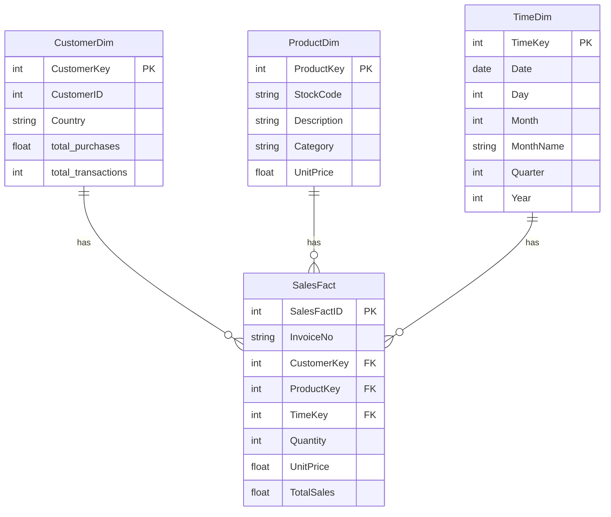
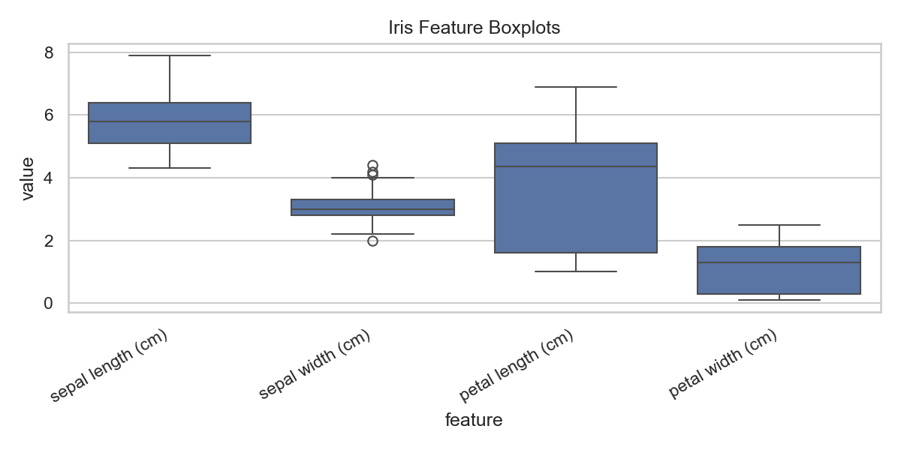
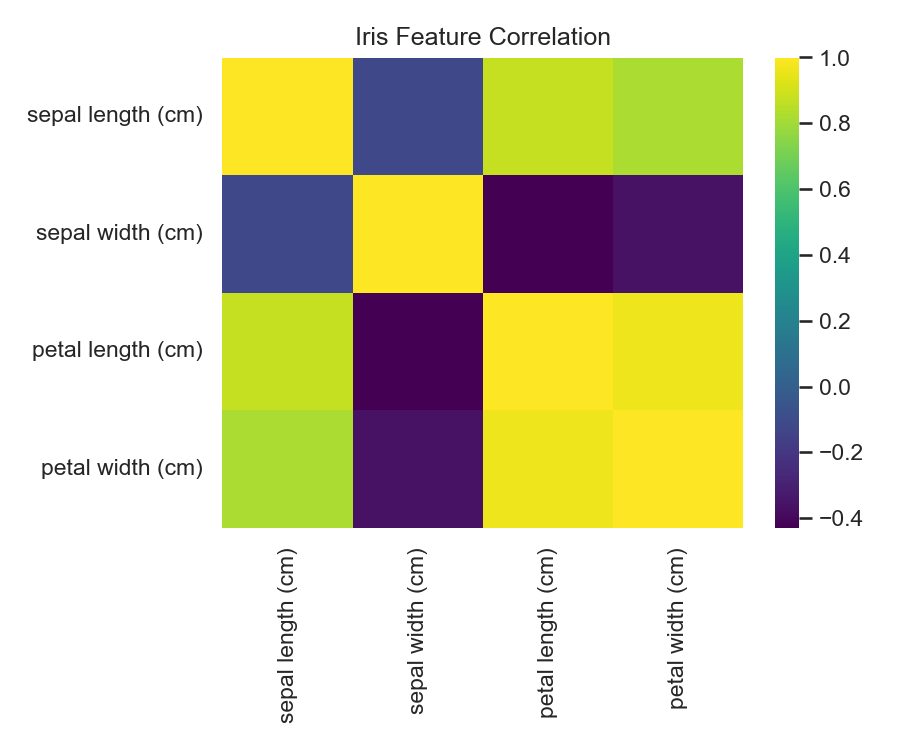
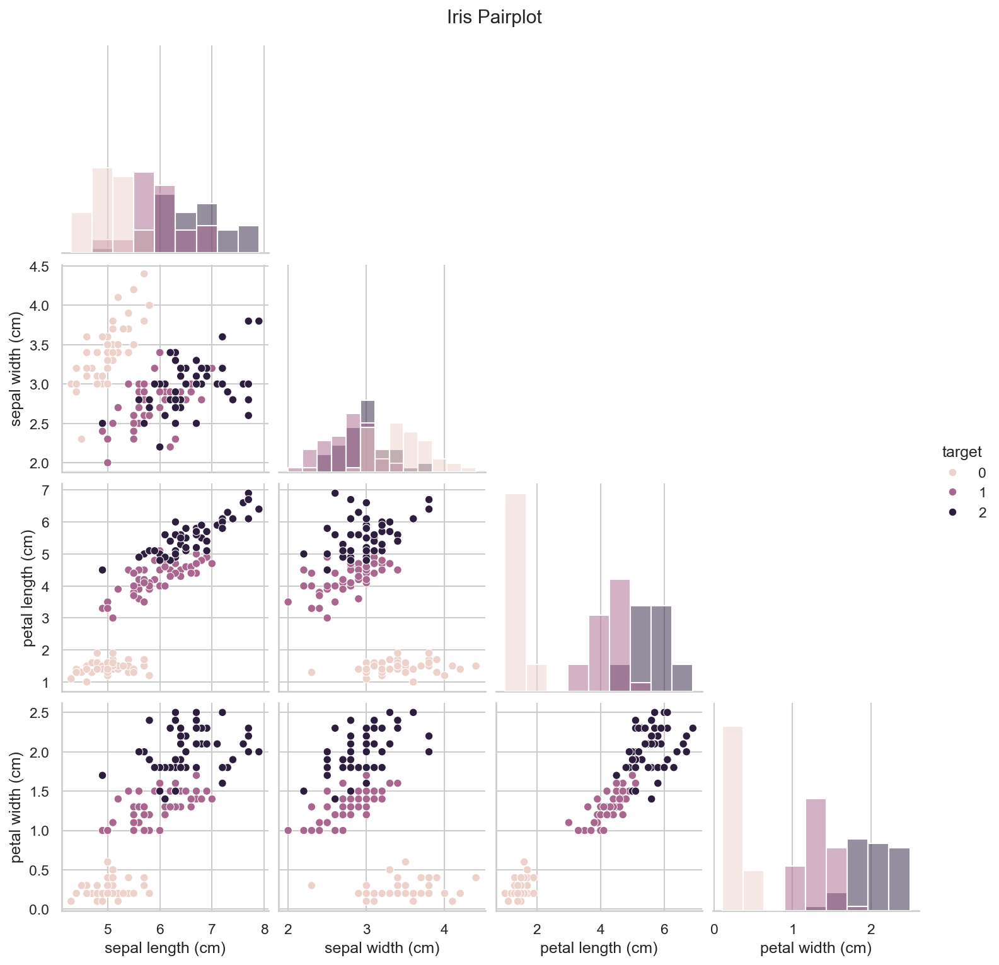
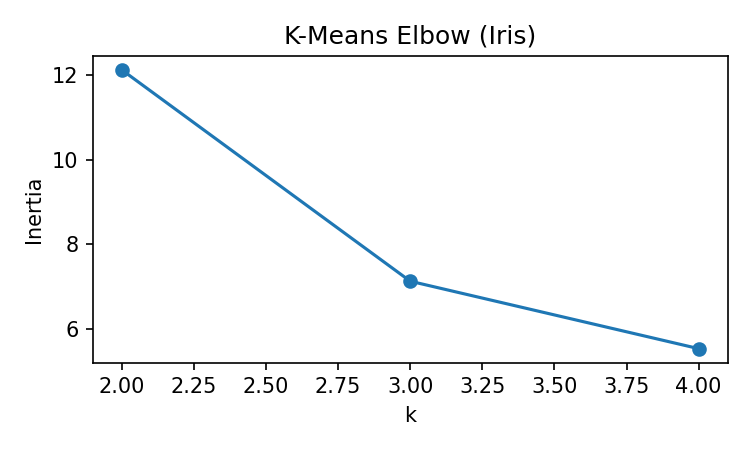
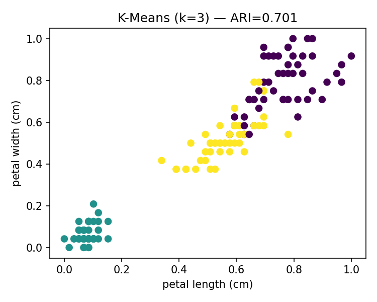
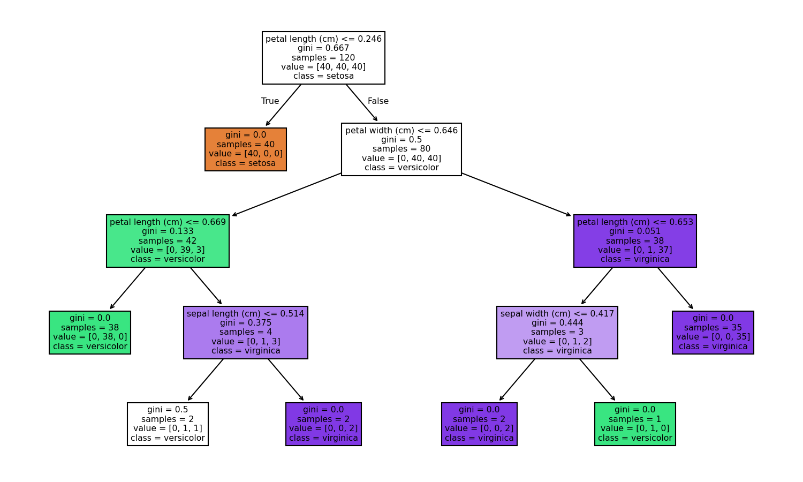

# DSA-2040 Practical Exam — Retail Data Warehouse & Data Mining

This repository contains solutions for:

* **Section 1: Data Warehousing** — star-schema design, ETL into SQLite, and OLAP queries.
* **Section 2: Data Mining** — preprocessing/EDA, clustering (K-Means), classification (DT vs KNN), and association rules (Apriori).

Everything runs locally with Python and Jupyter.

---

## Project Structure

```text
data_warehouse/
├─ etl/
│  └─ etl_retail.ipynb             # builds online_retail.csv + retail_dw.db
├─ olap/
│  ├─ queries.sql                  # roll-up, drill-down, slice
│  └─ olap_analysis.ipynb          # runs queries + saves chart/CSVs
├─ sql/
│  └─ schema.sql                   # DDL for star schema (SQLite)
└─ schema.png                      # star schema diagram image

data_mining/
├─ preprocessing_iris.ipynb        # Task 1: EDA + Min–Max scaling + splits
├─ clustering_iris.ipynb           # Task 2: K-Means (k=2/3/4) + ARI + plots
└─ mining_iris_basket.ipynb        # Task 3: DT vs KNN + Apriori rules
```

---

## Setup

```bash
python -m venv .venv
# Windows:
.\.venv\Scripts\activate
# macOS/Linux:
source .venv/bin/activate

pip install pandas numpy matplotlib scikit-learn seaborn mlxtend
```

SQLite (`sqlite3`) is included with Python.

---

## Section 1 — Data Warehousing

### Star Schema


If you don’t have `schema.png` yet, keep the Mermaid diagram below in this README (GitHub renders it), and optionally export a PNG later.



#### Why star (not snowflake)

A star schema keeps dimensions denormalized, so common BI queries (roll-ups, drill-downs) touch one fact table and a few wide dims with minimal joins—faster and easier to reason about. At this scale the storage overhead is tiny, while query latency and usability improve. If the model grows or stricter normalization is required, we could snowflake **Product** or **Time** later.

### ETL (Task 2)

Open `data_warehouse/etl/etl_retail.ipynb` and **Run All**.

**Outputs in the same folder:**

* `online_retail.csv`
* `retail_dw.db` (SQLite DW with `CustomerDim`, `ProductDim`, `TimeDim`, `SalesFact`)

The notebook prints row counts and validates `TotalSales = Quantity × UnitPrice`.

> **Note:** ETL filters to the last year relative to the configured date in the notebook (set to **2025-08-13**).

### OLAP (Task 3)

* **SQL:** `data_warehouse/olap/queries.sql`

  * **Roll-up:** totals by Country × Quarter
  * **Drill-down:** monthly totals for United Kingdom
  * **Slice:** total for Electronics category
* **Notebook:** `data_warehouse/olap/olap_analysis.ipynb`

  * Runs the queries and saves:

    * `sales_by_country.png`
    * `rollup_country_quarter.csv`
    * `drilldown_uk_monthly.csv`
    * `slice_electronics.csv`

#### OLAP Analysis (200–300 words)

The roll-up by country and quarter shows revenue concentrated in a handful of countries, suggesting inventory and marketing should be weighted toward those regions. Totals peak in Q4, indicating a seasonal effect useful for stock planning and staffing. The drill-down for the United Kingdom at monthly granularity reveals clear surges aligned with retail events and holidays; these windows are good targets for promotions and cross-sell bundles. The Electronics slice contributes a notable revenue share, implying depth in the assortment and responsiveness to pricing—good candidates for price-break tests and featured placement.

The warehouse’s star design (Customer, Product, Time, plus SalesFact) lets us answer these questions with short SQL—simple joins plus `GROUP BY`. Denormalized dimensions reduce joins and keep queries fast, ideal for dashboards. While data is generated by ETL, the pipeline mirrors a realistic process: cleansing, computed measures (`TotalSales`), a last-year filter for freshness, and surrogate keys for stable joins. In production we’d add indexes on foreign keys and `(Country, Quarter)`, partition the fact table by date, and schedule incremental loads. Overall, the model supports quick roll-ups, targeted drill-downs, and category slices that map directly to merchandising and regional planning.

---

## Section 2 — Data Mining

### Task 1 — Preprocessing & EDA (Iris)

**Notebook:** `data_mining/preprocessing_iris.ipynb`

* Loads Iris (Fisher, 1936) via scikit-learn (`load_iris`), checks missing values, applies Min–Max scaling.
* **Saves:** `iris_X_scaled.csv`, `iris_y.csv`, `iris_train.csv`, `iris_test.csv`
* **Visuals:**

  * 
  * 
  * 

### Task 2 — Clustering (K-Means)

**Notebook:** `data_mining/clustering_iris.ipynb`

* `K ∈ {2, 3, 4}`; computes Adjusted Rand Index (ARI) vs. labels, and an Elbow curve.
* Visualizes `k=3` clusters (petal length vs petal width).
* **Visuals:**

  * 
  * 

### Task 3 — Classification & Association Rules

**Notebook:** `data_mining/mining_iris_basket.ipynb`

* **Classification:** Decision Tree (`max_depth=4`) vs KNN (`k=5`) on scaled Iris

  * 
* **Association Rules (Apriori):** synthetic baskets (20–50 tx, 3–8 items/tx), support ≥ 0.2, confidence ≥ 0.5

---

## How to Run (Quickstart)

### Section 1

1. Run `data_warehouse/etl/etl_retail.ipynb` → builds `retail_dw.db`.
2. Run `data_warehouse/olap/olap_analysis.ipynb` → produces chart + CSVs.

### Section 2

1. Run `data_mining/preprocessing_iris.ipynb` → saves scaled data & EDA plots.
2. Run `data_mining/clustering_iris.ipynb` → K-Means, ARI, elbow, scatter.
3. Run `data_mining/mining_iris_basket.ipynb` → DT vs KNN + Apriori rules.

---

## Notes

* The Iris dataset is bundled with scikit-learn (`sklearn.datasets.load_iris`).
* The ETL notebook creates a small retail CSV and an SQLite warehouse for OLAP.
* If `schema.png` is missing, you can:

  1. Screenshot the Mermaid diagram above and save it as `data_warehouse/schema.png`, **or**
  2. Export via Mermaid CLI:

```bash
npx @mermaid-js/mermaid-cli \
  -i data_warehouse/schema.mmd \
  -o data_warehouse/schema.png \
  --backgroundColor white
```

---

## Submission Checklist

* `data_warehouse/sql/schema.sql`
* `data_warehouse/etl/etl_retail.ipynb` → `online_retail.csv`, `retail_dw.db`
* `data_warehouse/olap/queries.sql`, `olap_analysis.ipynb`, chart + CSVs
* `data_warehouse/schema.png` (or keep Mermaid block)
* `data_mining/` notebooks + generated plots/CSVs/MD
* README includes schema, rationale, OLAP analysis, run steps, and example outputs
